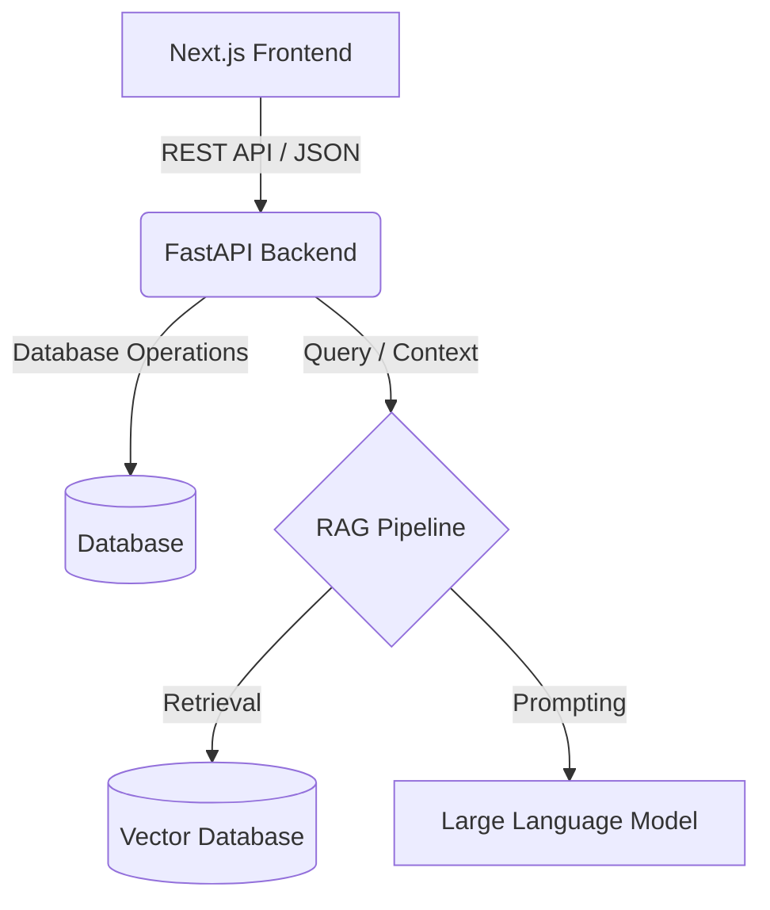

# SIBA Chatbot FYP


Welcome to the **SIBA Chatbot** Final Year Project (FYP). This system is designed as an intelligent AI assistant tailored for an educational institute (SIBA), providing students and staff with quick answers regarding faculty, university policies, and academic schemas.

---

## 📖 Overview

The SIBA Chatbot leverages **Retrieval-Augmented Generation (RAG)** to provide accurate, context-aware responses based on institutional data. It features a modern Next.js frontend, a robust FastAPI backend for serving API requests, and a specialized Python-based RAG pipeline handling data ingestion and intelligent retrieval.

---

## ✨ Features

- **Conversational AI**: Chat seamlessly with the bot to get answers regarding university policies, faculty info, and course schemas.
- **Voice Support**: Integrated audio capabilities for voice-based interactions.
- **Authentication**: Secure Google OAuth authentication and user session management.
- **Chat History**: Persistent chat sessions allowing users to revisit past conversations.
- **Admin Dashboard**: Specialized admin routes to manage chatbot configurations and view analytics.
- **Feedback Mechanism**: Users can provide feedback on chatbot responses to help improve accuracy.

---

## 🏗️ Architecture

The project is structured into three main decoupled layers:



- **Frontend**: A React application built with Next.js and Tailwind CSS, utilizing `lucide-react` for icons and `react-markdown` for rendering rich chat responses.
- **Backend**: A scalable FastAPI application handling routing, CORS, authentication, and database connections.
- **RAG Engine**: A dedicated module (`rag/`) responsible for data ingestion, text embedding, vector storage, and constructing the LLM response graph.

---

## 📁 Project Structure

```text
siba-chatbot-fyp/
├── frontend/               # Next.js web application
│   ├── app/                # App router pages
│   ├── components/         # Reusable React components
│   ├── lib/                # Utility functions and API clients
│   └── package.json        # Frontend dependencies
├── backend/                # FastAPI Application
│   ├── routes/             # API endpoints (auth, chat, audio, admin)
│   ├── models/             # Database schemas
│   ├── main.py             # FastAPI entry point
│   └── requirements.txt    # Backend Python dependencies
├── rag/                    # Retrieval-Augmented Generation Engine
│   ├── ingestion/          # Scripts to parse and chunk raw documents
│   ├── vector_db/          # Vector database configurations
│   ├── graph/              # LangGraph / workflow logic
│   ├── llm/                # LLM initialization and logic
│   └── data/               # Raw source documents (policies, schemas)
└── README.md               # This documentation file
```

---

## 🚀 Getting Started

### Prerequisites

- **Node.js** (v18+ recommended)
- **Python** (v3.9+ recommended)
- **Database** (MongoDB or PostgreSQL as configured in your `.env`)

### 1. Frontend Setup

Navigate to the `frontend` directory and install dependencies:

```bash
cd frontend
npm install
# Start the development server
npm run dev
```
*The frontend will be available at `http://localhost:3000`.*

### 2. Backend Setup

Navigate to the `backend` directory, create a virtual environment, and install dependencies:

```bash
cd backend
python -m venv venv
# Windows:
venv\Scripts\activate
# macOS/Linux:
source venv/bin/activate

pip install -r requirements.txt
```

Ensure your `.env` file is properly configured with your database URI and LLM API keys.

```bash
# Start the FastAPI server
uvicorn main:app --reload
```
*The backend API will be available at `http://localhost:8000`.*

### 3. RAG Initialization

The RAG components load their context upon backend startup (`_warmup_rag()`). Ensure your vector database is populated. You may need to run ingestion scripts inside the `rag/` directory to vectorize the latest institutional data before starting the backend.

---

## 🤝 Contributing

This project is part of a Final Year Project. Ensure all commits are properly documented and feature branches are used for new integrations.
